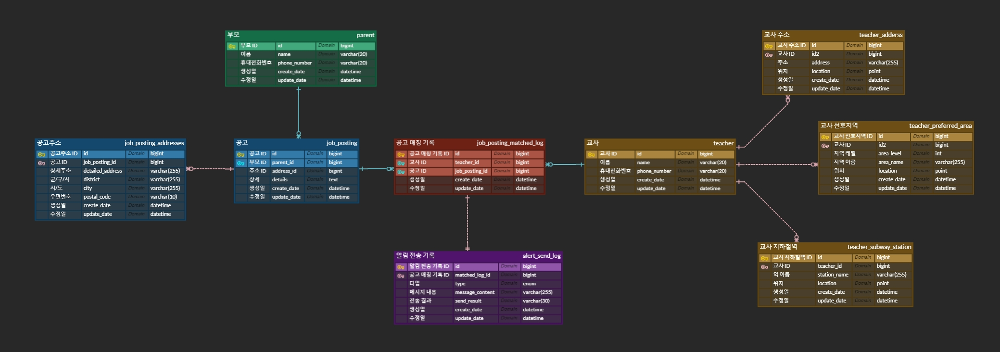

# 🚀 선생님 공고 추천

## 💻 개발 환경
- Java (17)
- Spring Boot (3.2.2)
- Gradle (8.5)
- MySql (8.3.0)
- JPA

***

## 📄 API 요구사항
- 공고 추천 API
    + requestBody -> 공고 주소 정보 (위도, 경도, 주소, 우편번호)
    + responseBody -> 추천 대상 선생님 정보 (선생님 이름, 전화번호)

***

## 📄 기술 요구사항
- SpringBoot를 사용하여 주세요
- Maven 또는 Gradle을 사용하여 주세요
- JPA를 사용하여 주세요
- MySQL을 사용하여 주세요
- Controller, Service, Model 계층은 필수 이고 나머지는 자유롭게 추가가능합니다
- 테이블은 자유롭게 변경하고 추가할 수 있습니다
- 테이블 생성 쿼리문을 따로 제출해 주세요
- API 문서는 Swagger로 작성하여 주세요

***

## 개요
- 째깍악어 서비스는 아이돌봄 서비스로써 선생님과 부모님을 연결합니다.
- 부모님이 올려주는 공고주소가 선생님이 원하는 장소(주소, 선호 지역, 지하철)에 있다면 해당 공고를 선생님께 추천합니다.
- 예를 들어 강남역 부근에 사시는 부모님이 선생님을 찾는 공고를 올렸습니다.
    + 선생님이 설정한 주소(강남대로 396)와 가까운 지역일 경우
    + 선생님이 설정한 선호하는 지역이 강남지역일 경우
    + 선생님이 설정한 지하철역이 강남역일 경우
- 선생님이 지정한 장소와 부모님이 공고에 올린 주소를 비교하여 자동으로 선생님께 공고를 안내하려 합니다.
- 선생님은 주소, 선호지역, 지하철역 기반 중 하나만 선택해서 공고 알림을 받는 것이 가능합니다.
- 장소 등록 기준과 알림을 위한 거리 측정에 대한 구체적인 조건은 아래와 같습니다.
- 선생님은 자신이 정한 주소를 n개 이상 선택할 수 있습니다. 이때 알림을 위한 거리는 주소로부터 5km 이내입니다.
- 선생님은 자신이 정한 선호지역(강남/서초, 용인/수원 등)을 n개 이상 선택할 수 있습니다.
- 선생님은 자신이 정한 지하철역 또는 노선을 n개 이상 선택할 수 있습니다. 이때 알림을 위한 거리는 역으로부터 1km 이내입니다.
- 과제 단순화를 위하여 부모님, 선생님, 선생님 주소, 선생님 지하철역, 선생님 선호 지역 데이터는 미리 생성되어 있는 것으로 가정합니다.
- 이 조건을 만족하게 하는 데이터 모델링(ERD)과 API를 작성하고, 프로세스를 설명하는 다이어그램(Flow Chart 또는 Sequence Diagram)을 작성해주시면 감사하겠습니다.

***

## 사용자 스토리
```
1. 수서역 근처에 사는 임째깍 선생님은 수서역에 있는 3호선과 분당선에 포함된 지하철역에서
   공고가 올라오면 해당 공고에 대해서 푸시로 알림을 받기를 원합니다.
   용인 죽전역 근처 1km에 사는 김배리 부모님이 공고를 올리면 임째깍 선생님은 해당 공고를 받습니다.
2. 수원지역에 사는 정악어 선생님은 차로 이동합니다.
   정악어 선생님은 거리에 상관없이 수원/용인 선호 지역에서 올라오는 공고에 대해서 알림을 받고 싶어 합니다.
3. 서울 영등포구 당산동에 사는 박소심 선생님은 자기 집 근처 5km 이내에서
   공고가 올라오는 경우만 알림을 받고 싶어 합니다.
```

***

## 기본공고와 공고 주소 모델링


## ERD
[ERD 링크](https://www.erdcloud.com/d/92rMKjPaa4LTaNXTS)


***

## Entity
```
1. 공고
    - ID
    - 부모 ID
    - 공고 주소 ID
    - 공고 상세
2. 공고 주소
    - ID
    - 상세주소
    - 군/구/시
    - 시/도
3. 부모
    - ID
    - 이름
    - 휴대전화번호
4. 교사
    - ID
    - 이름
    - 휴대전화번호
5. 교사 주소
    - ID
    - 교사 ID
    - 주소
    - 위치
6. 교사 지하철
    - ID
    - 교사 ID
    - 역 이름
    - 위치
7. 교사 선호지역
    - ID
    - 교사 ID
    - 지역 레벨
    - 지역 이름
    - 위치
8. 공고 매칭 기록
    - ID
    - 교사 ID
    - 공고 ID
9. 알림 전송 기록
    - ID
    - 공고 매칭 기록 ID
    - 알림 타입
    - 메시지 내용
    - 전송 결과
```

***

## 연관 관계
- 공고
    + 공고는 공고주소들의 정보를 알고 있다.
    + 공고는 공고주소와 일대다(1:N) 단방향 관계다.
    + 공고와 부모는 다대일(N:1) 양방향 관계다.
    + 공고와 공고 매칭 기록은 일대다(1:N) 단방향 관계다.
- 공고주소
    + 공고주소와 공고는 다대일(N:1) 단방향 관계다.
- 부모
    + 부모와 공고는 일대다(1:N) 양방향 관계다.
- 교사
    + 교사와 교사 주소는 일대다(1:N) 단방향 관계다.
    + 교사와 교사 지하철은 일대다(1:N) 단방향 관계다.
    + 교사와 교사 선호지역은 일대다(1:N) 단방향 관계다.
    + 공고와 공고 매칭 기록은 일대다(1:N) 단방향 관계다.
- 교사 주소
    + 교사 주소와 교사는 다대일(N:1) 단방향 관계다.
- 교사 지하철
    + 교사 지하철과 교사는 다대일(N:1) 단방향 관계다.
- 교사 선호지역
    + 교사 선호지역과 교사는 다대일(N:1) 단방향 관계다.
- 공고 매칭 기록
    + 공고 매칭 기록과 공고는 다대일(N:1) 양방향 관계다.
    + 공고 매칭 기록과 교사는 다대일(N:1) 양방향 관계다.
    + 공고 매칭 기록과 알림 전송 기록은 일대일(1:1) 단방향 관계다.
- 알림 전송 기록
    + 알림 전송 기록과 공고 매칭 기록은 일대일(1:1) 단방향 관계다.

***

## 📈 To-Do
- [x] 테이블 설계 & SQL, ERD 작성
- [x] 플로우 차트 작성
- [x] 엔티티 연관관계 맵핑
- [x] 위,경도 데이터를 주소로 변환하는 지오코딩 서비스 구현 (국토교통부 오픈 API 이용) 
    + 구글의 지오코딩 api 사용하려 했으나 요금 발생해서 해당 과제에서는 제외함. 실서비스에서는 성능이 우월한 구글 api 사용.
- [ ] 두 개의 위,경도 간의 거리를 계산하는 서비스 구현
- [ ] 공고 추천 API 구현
    + 공고 주소 정보 (위,경도)를 입력 시 아래 조건에 해당되는 교사의 정보를 리턴한다.
        + 선생님이 정한 주소들의 위,경도와의 거리 비교. 5km 이내일 경우
        + 선생님이 정한 지하철역 또는 노선들의 위,경도와의 거리 비교. 1km 이내일 경우
        + 선생님이 정한 선호지역들과 같은 지역인지 비교. (시/도, 군/구/시)
